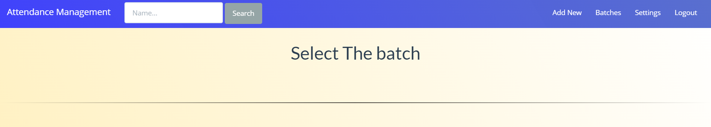

# Guide on using this Project
## Default username & password
I have added a default user so that on can sign in to use this project.

username : **Admin** || Password : **1234**

## Adding student

After logging in you will see this page where on the top right corner you will se an **Add New** button clicking it will take you to another page where you can add students

> In mobile view things may look differ and as there will be a hamburger menu when all the things will be collapsed

To Add students in Bulk simply click on the **Upload CSV file** it will guide you on how to make one and upload it

## Manging Batches
Afer you add the student you will be taken to the batch page and you will be able to see added student 

Clicking student name will open the student profile you can add remarks and see the attendance percentage of a student but for now it will be zero as no attendance is made right now

## Making Attendance
Click on checklist to get the lsit of all student in a batch **Red** indicates *absent* and clicking the names turn it **green** indicate *present* 

 

Enter the Reason of taking attendance and submit will save the attendance.

## Checking Overall Attendance Analysis
On the Batch page if you click on View Attendance then it will take you to the attendance analysis page.

Clicking on Attendance will open the full sheet of particualar day, and attendance can be exported as CSV file from the website.

Graph can be also seen on this page.

---

> These are the base features and uses one should know other things like adding a user or managing access can be explored by anyone by seeing the code and observing the website.

To Make any change or add feature reffer [Contribution.md](contribution.md)